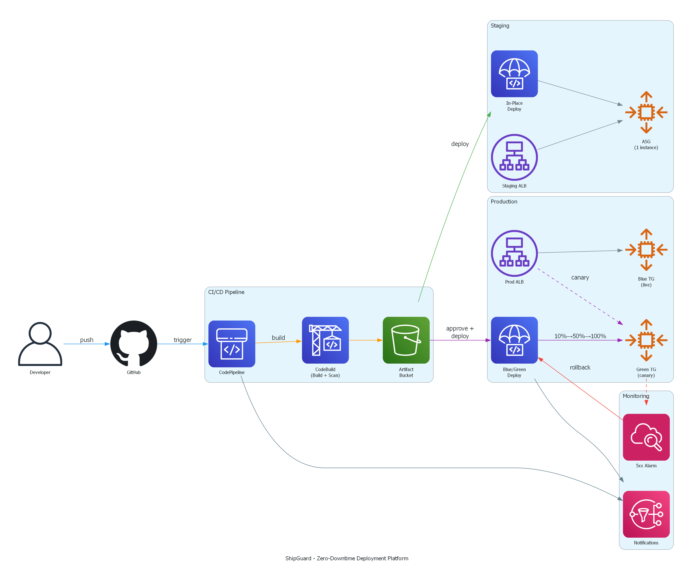

# ShipGuard

A CI/CD pipeline that actually rolls back when things break.

You push code, ShipGuard builds it, scans it for vulnerabilities, deploys to staging, waits for your approval, then rolls it out to production using blue/green with canary traffic shifting. If the new version starts throwing 5xx errors, traffic shifts back to the old version automatically. No pager, no 3am scramble.



## What it does

ShipGuard is a CodePipeline with five stages:

1. **Source**  pulls from GitHub via CodeStar connection
2. **Build and Test**  CodeBuild runs npm audit, Trivy, git-secrets, your test suite, then compiles TypeScript
3. **Deploy to Staging**  in-place deployment to a single EC2 instance, health-checked
4. **Manual Approval**  you get an email, you click approve (or reject)
5. **Deploy to Production**  blue/green deployment: 10% traffic for 5 minutes, then remaining 90%

If CloudWatch sees more than 10 5xx errors in 60 seconds during the canary phase, CodeDeploy shifts all traffic back to the old version and terminates the new instances. You get an SNS notification telling you what happened.

## The architecture

The pipeline deploys a TypeScript/Express app to EC2 instances behind Application Load Balancers. Production has two target groups (blue and green) for zero downtime swaps. Staging uses a simpler in-place strategy because speed matters more there.

Everything is CloudFormation. Three stacks:

- `infrastructure/staging.yaml`  VPC, ALB, single-instance ASG, security groups, IAM
- `infrastructure/production.yaml`  VPC, ALB with dual target groups, multi-instance ASG, CloudWatch alarm, IAM
- `infrastructure/pipeline.yaml`  CodePipeline, CodeBuild, CodeDeploy, S3 bucket, SNS topics, IAM roles

## Security scanning

The build fails if any of these find problems:

- `npm audit --audit-level=high`  dependency vulnerabilities
- `trivy fs --severity HIGH,CRITICAL --exit-code 1`  OS and library vulns
- `git secrets --scan`  accidentally committed AWS keys or secrets

No high/critical vulns reach staging. Period.

## Project structure

```
ShipGuard/
├── infrastructure/
│   ├── staging.yaml
│   ├── production.yaml
│   └── pipeline.yaml
├── scripts/
│   ├── before_install.sh
│   ├── after_install.sh
│   ├── start_application.sh
│   └── validate_service.sh
├── tests/
│   ├── validate-templates.sh
│   └── test-deployment-scripts.sh
├── docs/
│   ├── architecture.png
│   ├── architecture.svg
│   └── generate_architecture.py
├── buildspec.yml
├── appspec.yml
├── LICENSE
└── README.md
```

## Prerequisites

Before you deploy, you need:

- An AWS account with permissions to create CloudFormation stacks
- A CodeStar connection to your GitHub repo (create in the AWS Console under Developer Tools > Connections)
- An EC2 key pair in your target region
- A TypeScript/Express app with a `/health` endpoint that returns 200

## Deploy

The stacks depend on each other, so deploy in order:

```bash
# 1. Staging environment
aws cloudformation create-stack \
  --stack-name shipguard-staging \
  --template-body file://infrastructure/staging.yaml \
  --parameters ParameterKey=KeyPairName,ParameterValue=your-key \
  --capabilities CAPABILITY_NAMED_IAM

# 2. Production environment
aws cloudformation create-stack \
  --stack-name shipguard-production \
  --template-body file://infrastructure/production.yaml \
  --parameters ParameterKey=KeyPairName,ParameterValue=your-key \
  --capabilities CAPABILITY_NAMED_IAM

# 3. Wait for both to finish
aws cloudformation wait stack-create-complete --stack-name shipguard-staging
aws cloudformation wait stack-create-complete --stack-name shipguard-production

# 4. Pipeline (references the other two stacks via cross-stack exports)
aws cloudformation create-stack \
  --stack-name shipguard-pipeline \
  --template-body file://infrastructure/pipeline.yaml \
  --parameters \
    ParameterKey=NotificationEmail,ParameterValue=you@example.com \
    ParameterKey=GitHubOwner,ParameterValue=your-github-username \
    ParameterKey=GitHubRepo,ParameterValue=your-repo-name \
    ParameterKey=CodeStarConnectionArn,ParameterValue=arn:aws:codestar-connections:... \
  --capabilities CAPABILITY_NAMED_IAM
```

After the pipeline stack is up, confirm the SNS email subscriptions that land in your inbox. Then push code to your repo and the pipeline triggers.

## How the blue/green deployment works

Before a deployment, all traffic goes to the Blue target group. When you approve a release:

1. CodeDeploy spins up new instances in the Green target group with the new version
2. Green instances pass the `/health` check
3. ALB shifts 10% of traffic to Green for 5 minutes
4. If the CloudWatch alarm stays quiet, the remaining 90% shifts to Green
5. After 5 more minutes with no alarm, Blue instances get terminated
6. Green is now the live target group

If the alarm fires at any point during step 3 or 4, traffic goes 100% back to Blue and the Green instances are killed. You get a notification.

## Cost

With both environments running: roughly $40-55/month. The ALBs are the main cost (~$16 each). EC2 instances are t3.micro. Tear down staging when you're not testing to cut it in half.


## License

MIT
